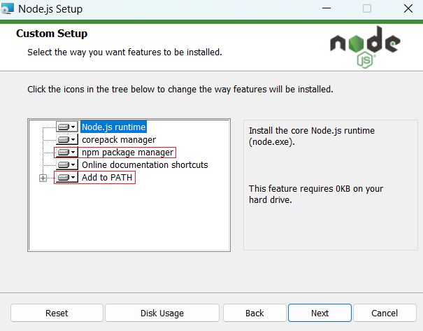
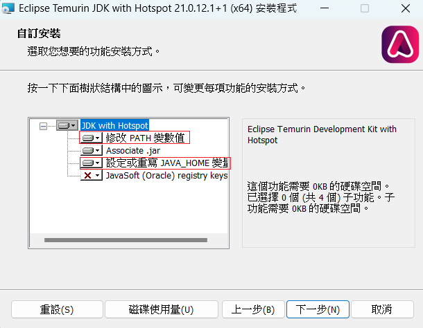
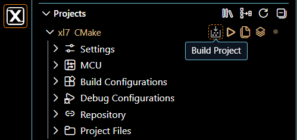

# LPC55S6x 專案自動產出符合 CRA 規範的 SBOM ( Windows 版 )

在  **Windows**  環境下，要針對 `LPC55S6x + FreeRTOS` 專案自動產出符合 **CRA** 規範的 **SBOM**，最推薦的做法是將 SBOM 工具直接整合進 CMakeLists.txt 的建置流程中。

這樣一來，每次在 **VS code** 建置時，就會自動掃描原始碼、外部 SDK、FreeRTOS 套件，並輸出最新的 CycloneDX 或 SPDX 檔案。

---

## 📋 目錄

1. [步驟 1：準備 Windows 必要環境](#步驟-1準備-windows-必要環境)
2. [步驟 2：修改 CMakeLists.txt](#步驟-2修改-cmakelists.txt)
3. [步驟 3：在 VS Code 建置與產出 SBOM](#步驟-3在-vs-code-建置與產出-sbom)
4. [後續常見問題與驗證](#後續常見問題與驗證)

---

## 步驟 1：準備 Windows 必要環境

`cdxgen` 在進行 C 語言語意剖析時，需依賴 **Node.js** 的 CLI 工具以及 **Java (JDK)** 的語法樹分析（AST）解析器。

### 1.1 安裝 Node.js (含 npm)

1. 下載並安裝 [Node.js LTS 版本](https://nodejs.org/)。
2. 全程採用預設選項安裝（確認勾選 `Add to PATH` 與 `npm package manager`）。



### 1.2 安裝 OpenJDK (JDK 21 或 17+)

1. 下載並安裝 [Adoptium Temurin JDK 21](https://adoptium.net/) 的 `.msi` 檔。
2. 安裝時請確保勾選：
   * 🟢 **Set JAVA_HOME variable**
   * 🟢 **Add to PATH**
   



### 1.3 全域安裝 `cdxgen`

開啟 PowerShell 或 CMD 執行全域安裝指令：

```powershell
npm install -g @cyclonedx/cdxgen
```

---

## 步驟 2：修改 CMakeLists.txt

在 VS Code 環境下使用 CMake Tools 時，必須確保 CMake 產生 **`compile_commands.json`**（編譯資料庫），供 `cdxgen` 解析 C/C++ 原始碼依賴。

請將專案根目錄的 `CMakeLists.txt` 新增或修改以下內容：

```cmake
cmake_minimum_required(VERSION 3.15)
project(LPC55S69_Project C CXX)

# 1. 強制輸出編譯資料庫 (compile_commands.json)
set(CMAKE_EXPORT_COMPILE_COMMANDS ON)

# ------------------------------------------------------------------
# 專案目標檔與 SDK 相關設定 (請替換為您原本的 executable 名稱)
# ------------------------------------------------------------------
# add_executable(lpc55s69_app ${YOUR_SOURCE_FILES})

# ------------------------------------------------------------------
# Windows & VS Code 相容之 CycloneDX SBOM 自動產生器
# ------------------------------------------------------------------
find_program(CDXGEN_EXECUTABLE 
    NAMES cdxgen cdxgen.cmd cdxgen.bat
)

if(CDXGEN_EXECUTABLE)
    message(STATUS "Found cdxgen: ${CDXGEN_EXECUTABLE}")

    # compile_commands.json 所在位置 (即 build 目錄)
    set(REAL_BUILD_DIR "${CMAKE_CURRENT_BINARY_DIR}")
    
    # SBOM 最終輸出的檔案路徑 (預設產出於專案根目錄)
    set(SBOM_OUTPUT_FILE "${CMAKE_SOURCE_DIR}/bom.cyclonedx.json")

    # 新增自動化建置 Target
    add_custom_target(generate_sbom ALL
        COMMAND ${CDXGEN_EXECUTABLE} -t c -o "${SBOM_OUTPUT_FILE}" .
        COMMENT "Generating CRA-compliant CycloneDX SBOM via cdxgen..."
        WORKING_DIRECTORY "${REAL_BUILD_DIR}"
    )

    # 確保主要韌體 (.elf/.bin) 編譯完成後才執行 SBOM 產生
    if(TARGET lpc55s69_app)
        add_dependencies(generate_sbom lpc55s69_app)
    endif()

else()
    message(WARNING "cdxgen Executable not found! Please run 'npm install -g @cyclonedx/cdxgen'")
endif()
```

---

## 步驟 3：在 VS Code 建置與產出 SBOM

利用 VS Code 的 **CMake Tools** 擴充套件可以輕鬆完成圖形化或命令列建置。

### 方式 A：使用 VS Code 狀態列（UI 建置）

1. **選擇工具鏈 (Kit)**：
   點擊 VS Code 底部狀態列的 **`CMake: [No Kit Selected]`**，選擇對應 LPC55S6x 的 **Arm GNU Toolchain** (例如 `arm-none-eabi-gcc`)。
2. **選擇 Target**：
   在底部狀態列點擊 `[all]` 或目標檔案。
3. **執行建置**：
   點擊底部狀態列的 **`Build`**（或按快捷鍵 `F7`）。
   



4. **確認產出**：
   建置完成後，打開 VS Code 的檔案瀏覽器，確認專案根目錄是否產出 **`bom.cyclonedx.json`**。


### 方式 B：使用 VS Code 內建 Terminal (CLI 建置)

1. 按 `Ctrl + ~` 開啟 VS Code 內建 Terminal (PowerShell)。
2. 執行建置：
   ```powershell
   cmake --build build
   ```
3. 若僅想單獨執行 SBOM 產出 Target：
   ```powershell
   cmake --build build --target generate_sbom
   ```

---

## 後續常見問題與驗證

### a. `npm` 無法執行解決法 (PowerShell 權限問題)

如果在 VS Code 的 Terminal 輸入 `npm` 時出現：
> *`npm : 因為這個系統上已停用指令碼執行，所以無法載入 npm.ps1...`*

**解決方案**：
1. 以一般使用者身份開啟 VS Code 內建 Terminal。
2. 執行以下指令解除 PowerShell 當前使用者的安全限制：
   ```powershell
   Set-ExecutionPolicy RemoteSigned -Scope CurrentUser
   ```
3. 輸入 **`Y`** 按 Enter 確認。
4. **重啟 VS Code** 讓環境設定生效。

### b. 測試 Node.js、Java、cdxgen 與 npm

請在 VS Code Terminal 中逐一驗證以下工具是否可正確讀取：

```powershell
# 1. 驗證 Node.js 與 npm
node -v
npm -v

# 2. 驗證 Java 環境 (語義分析必需)
java -version

# 3. 驗證 cdxgen 工具
cdxgen --version
```

> 💡 **預期結果**：全部指令皆正常輸出版本號，且未出現 `CommandNotFoundException` 或權限錯誤。

### c. 手動獨立測試 cdxgen (免透過 CMake)

若需驗證 `cdxgen` 針對現有專案的獨立掃描能力：
1. 確保已於 VS Code 完成一次 Build 並產出 `build/compile_commands.json`。
2. 切換至 `build` 目錄手動執行：
   ```powershell
   cd build
   cdxgen -t c -o ..\bom.cyclonedx.json .
   ```