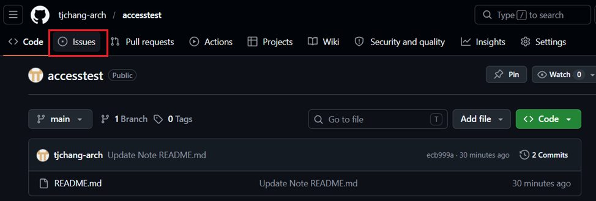
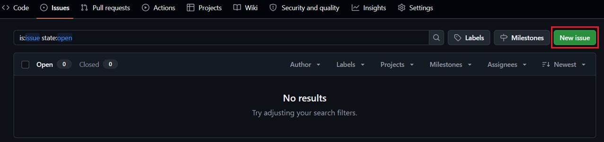
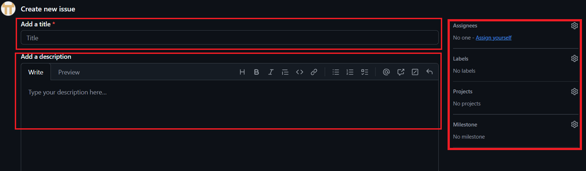
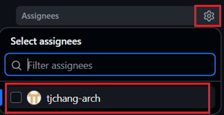
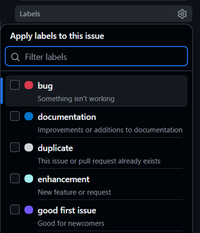
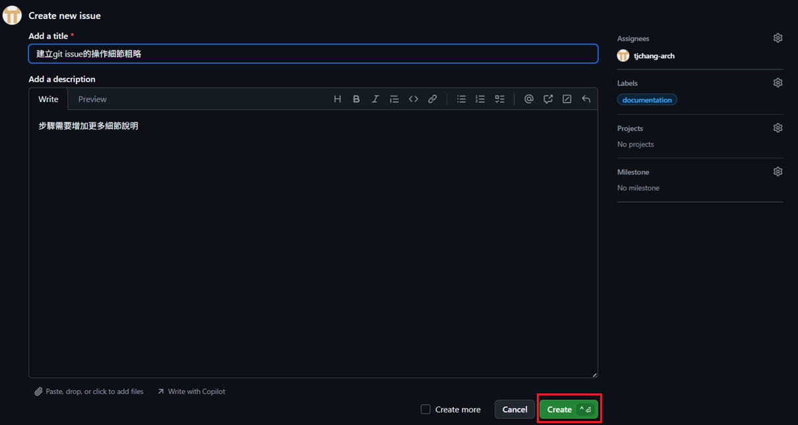
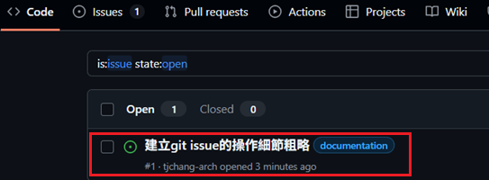
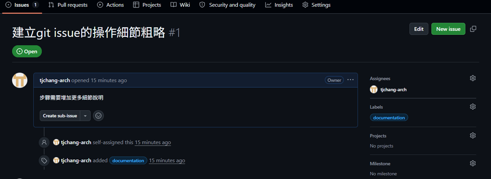

## 建立 Issue 操作步驟

### 步驟 1：進入專案
首先進入專案頁面。

---

### 步驟 2：進入專案議題頁面
點選畫面上方導覽列的 **[Issues]** 功能標籤。

---

### 步驟 3：新增 Issue
進入 Issues 頁面後，點選右側的綠色 **[New issue]** 按鈕。

---

### 步驟 4：填寫議題內容
在建立新議題的頁面中，請依序完成以下欄位填寫：
* **[Add a title]**：輸入該 Issue 的標題名稱。
* **[Add a description]**：詳細輸入該議題的描述內容。

---

### 步驟 5：指派負責人 (Assignees)
在頁面右側的 **[Assignees]** 區域點選設定圖示（齒輪），於 **[Select assignees]** 列表中點選欲指派的對象。

---

### 步驟 6：設定議題性質 (Labels)
在右側的 **[Labels]** 區域點選設定圖示（齒輪），依據該議題的性質選擇對應的標籤。

> ?? **關於 Labels 的說明：**
> Labels 性質預設已經內建 9 種，也可以依據需求自訂 Labels。目前預設的 Labels 包含：
> * `bug`：問題（程式出錯）
> * `documentation`：文件修正或新增
> * `duplicate`：重複問題
> * `enhancement`：新功能或請求
> * `good first issue`：適合新手的簡單議題
> * `help wanted`：需要額外關注與協助
> * `invalid`：不正確或無效的議題
> * `question`：疑問
> * `wontfix`：不會進行處理或修復

---

### 步驟 7：提交並建立 Issue
確認所有欄位與設定皆填寫完成後（填寫範例如下圖所示），點選右下角的綠色 **[Create]** 或 **[Submit new issue]** 按鈕送出。

*(範例：標題輸入「建立git issue的操作細節粗略」，描述輸入「步驟需要增加更多細節說明」，並掛上 `documentation` 標籤)*

---

## ?? 檢視與追蹤狀態

點入可看議題細節和處理狀態。

