## **Git分支與合併基本操作**

## 

## **概念說明**

*在程式開發中，如需同一軟體但只針對不同需求的參數做調整，*

*就會用到的分支（branch）與合併（merge），其範例操作如下：*

1.  *新創一個文件。*

2.  *以此為原生專案使用。*

3.  *因應原生專案下的延伸專案建立一個文件。*

4.  *在這個分支上進行文件增加內容。*

*之後在某個延伸專案上發現錯誤，修正之後需引用到整個有的專案， 以下為處方式：*

1.  *切換到發佈文件用的分支。*

2.  *在同一個提交上建立一個新分支，在這個分支上修正描述。*

3.  *認可後，切回發佈文件用的分支，將修正用的分支合併進來，然後再推送（push）出去發佈。*

4.  *切換到之前應用新需求的分支以繼續修改文件。*

**查看分支列表**

git branch \--list

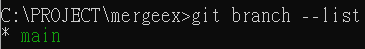

查看在分支\[main\]底下的操作記錄

git log \--oneline \--graph \--decorate \--all

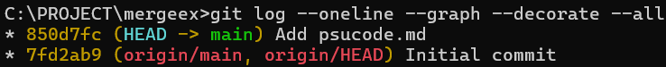

其中在說明\[Initial commit\]中，是新創repository的記錄，再上一行的說明\[Add psucode.md\]是新增文件**psucode.md**以及加入內容.

**建立全新的分支**

git branch \[branch name\]

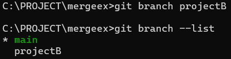

雖然已在此repository之中創建新的分支，但目前操控分支仍停留在\[main\]

在查看記錄之中，此節點屬於分支\[main\]和\[projectB\]

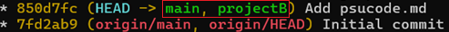

**切換到新創的分支**

git switch \[branch name\]

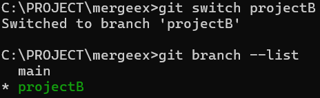

當查看操作記錄，會看到選定的分支換成\[projectB\]

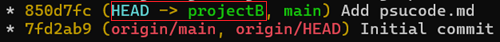

更新檔案\[[[psucode.md]]\]之後，可以看到選定分支節點已前進.

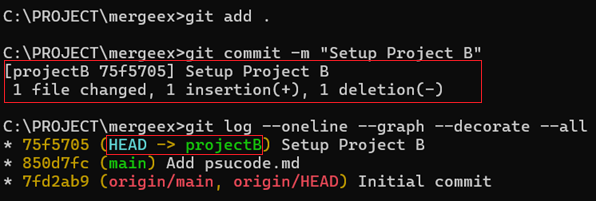

顯示內容:

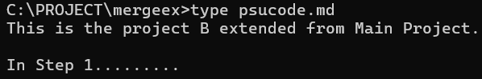

當切換回分支\[main\]時，**[HEAD]{.underline}**會指回\[main\]

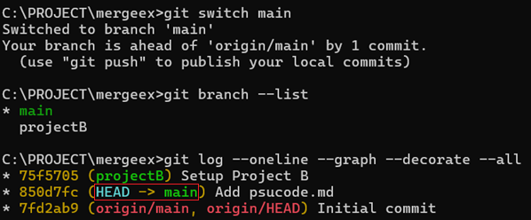

內容也會變回原本分支的原文:

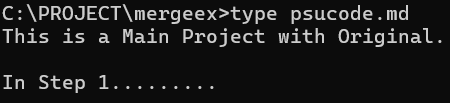

隨著分支的切換，同檔案下的內容也跟著改變.

隨著分支的發展推進，會看到顯著的樹狀結構圖

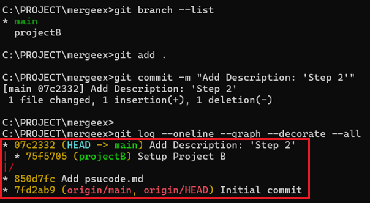

分支\[main\]持續向上更新

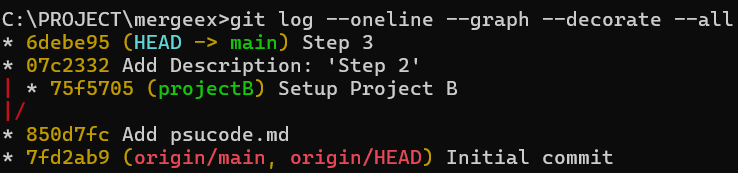

目前在分支\[main\]內容

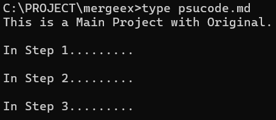

目前在分支\[projectB\]內容

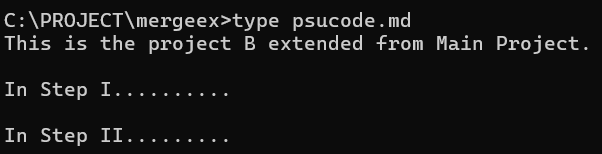

分支記錄

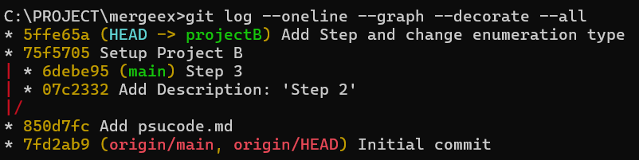

**合併分支:**

創建新的分支，並切換到新創的分支\[desfix\]

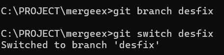

在分支\[desfix\]之下，內容修改

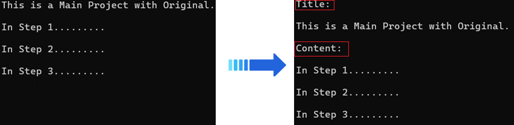

切換回分支\[main\]

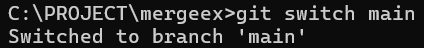

執行合併(merge)動作

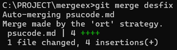

指令中所謂合併(merge)分支\[desfix\]

是將\[desfix\]的修改內容，併入到分支\[main\]之中

合併前後內容:

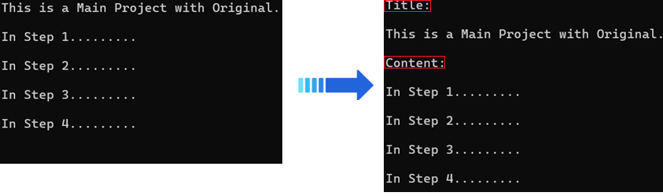

操作記錄:

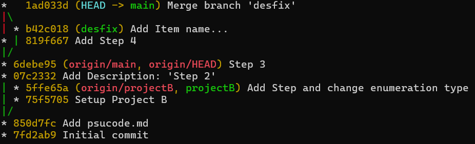

從操作記錄可以很清楚看到，在分支\[main\]先新增內容，然後合入分支\[desfix\]的修改內容

**刪除指定的分支:**

git branch -d \[branch name\]

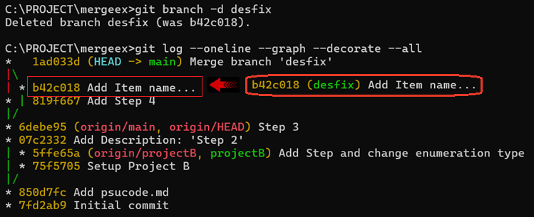

在刪除分支\[desfix\]之後，相關操作記錄還是存在，但分支名稱就消失了.
