# Window 安裝執行 Git 流程
步驟一：連結到  Git 官網 ，首頁會有下載 Git 按鈕，如下圖箭頭紅框處。

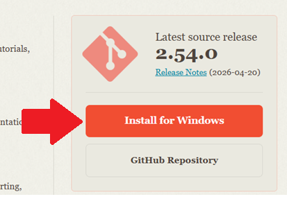

步驟二：官網會跳轉下載頁面，並自動下載，若沒有自動觸發，可點選下圖連結位置手動下載。轉址過去過幾秒就會自動下載。

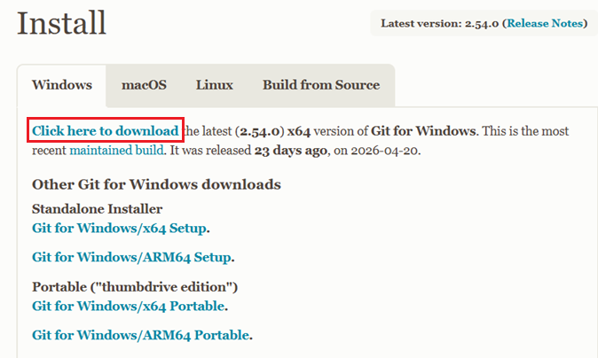

安裝過程

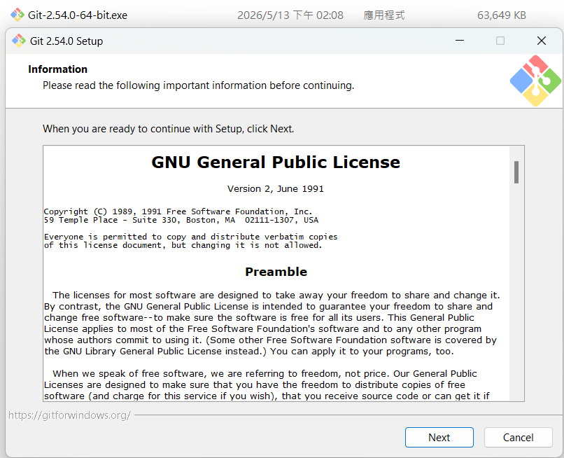

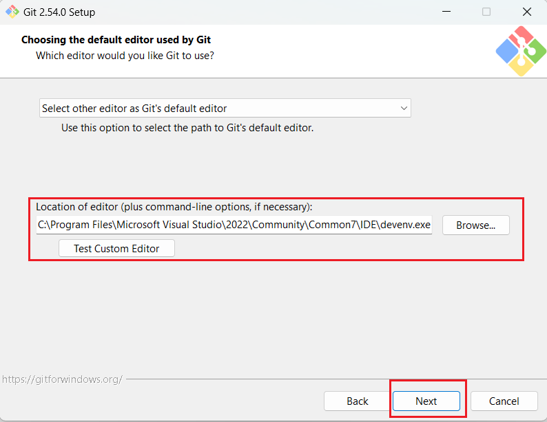

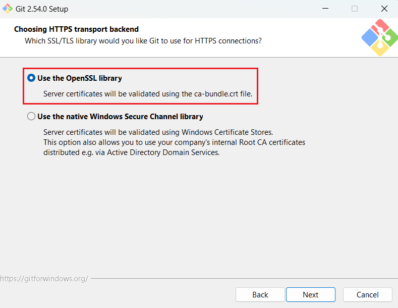

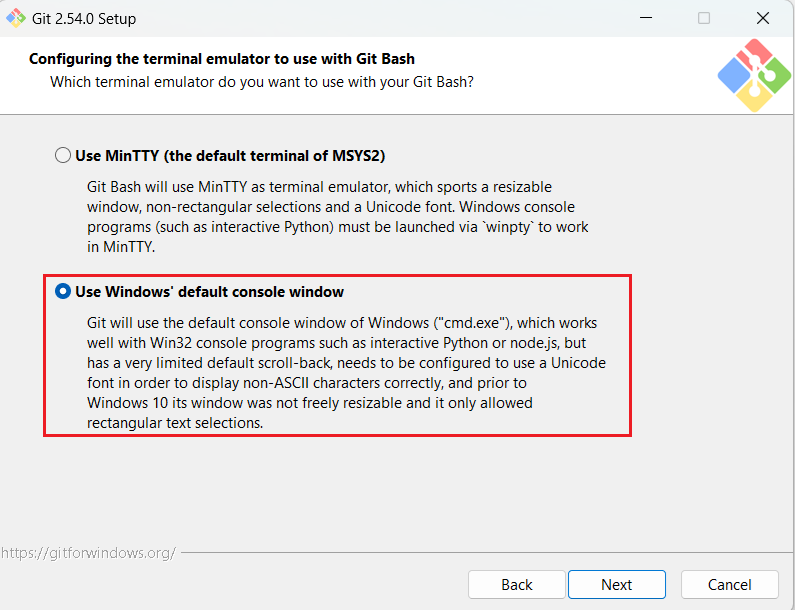

執行測試

步驟一：按下鍵盤上的  Window + S 按鍵  呼叫搜尋功能

步驟二：輸入關鍵字「命令提示字元」、「PowerShell」或「Git Bash」，尋找到對應軟體後，按下 Enter
以下圖片將以 PowerShell 當作示範。

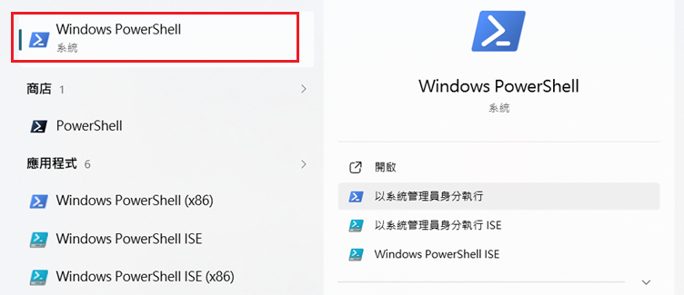

步驟三：複製此指令「 git --version 」，並在終端機點選滑鼠右鍵，選擇「Paste」貼上後，按 Enter
如安裝成功，系統回饋如下圖：

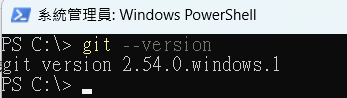

連線測試

Git server 是透過ssh連線存取專案源始碼.
步驟一： 在Windows 11, ssh 指令有些是內建，需先檢查系統內部安裝狀況

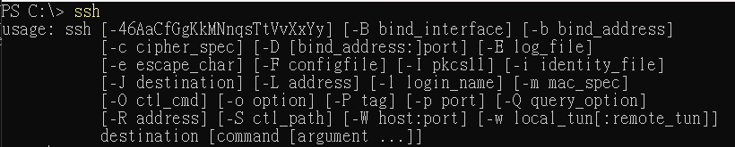

步驟二： 使用指令[ssh-keygen]產生金鑰.

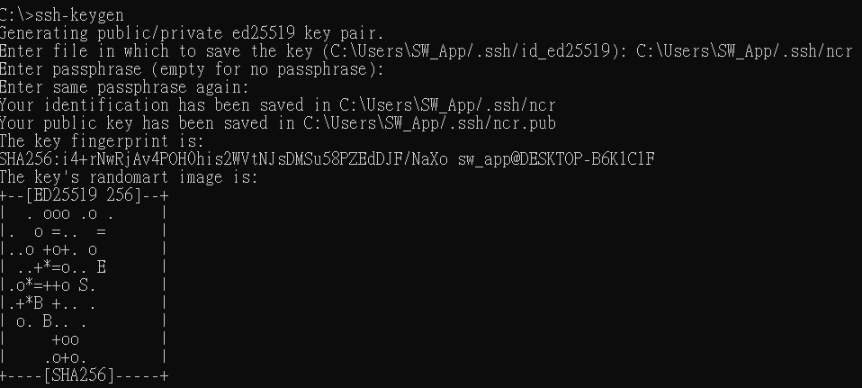

步驟三： 建立設定檔[config]

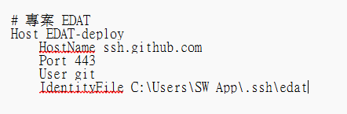

步驟四： 連線

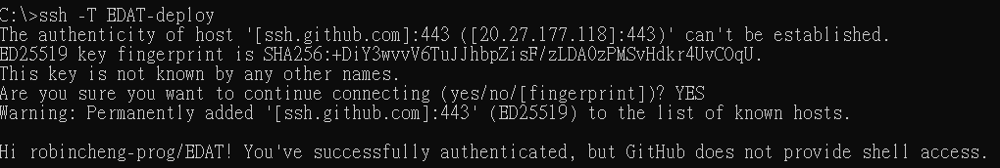

下載專案測試

步驟一： 先建立專案根目錄，將接下的專案源始碼檔案包集中

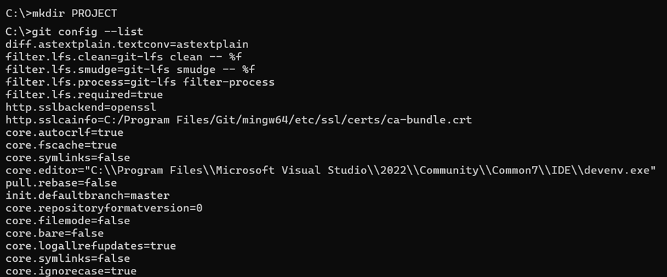

步驟二： 新增設定user.name 和 user.email

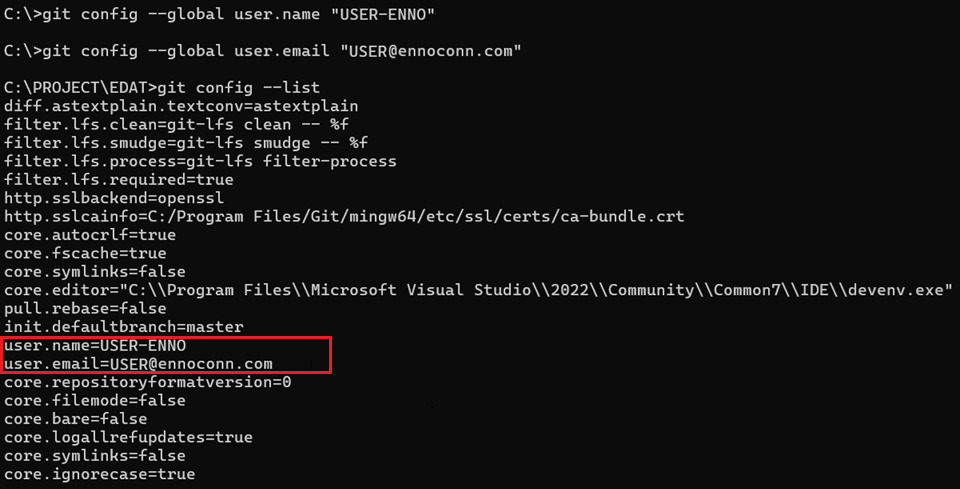

步驟三： 測試連線和取得源始碼

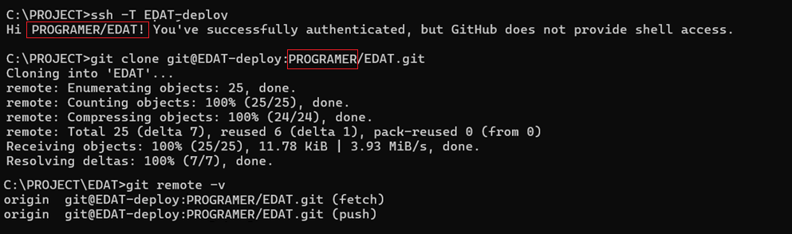