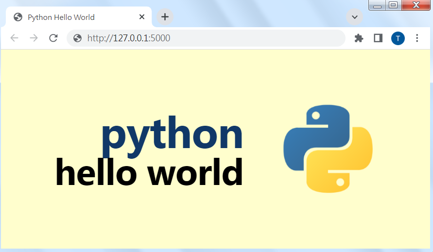

# Build Web Server by Python

---




## 1. Pre-Required Modules & Installation

To run a web server with Flask, ensure Python is installed and the Flask package is added to your Python environment.

* **Python 3.7+**: Verify your installation in Command Prompt or Terminal:
```bash
python --version

```


* **Flask Installation**: Install Flask using Python's package manager (pip):
```bash
pip install flask

```


---

## 2. Project Structure & Sample Code

Organize your project directory as follows:

```text
flask_app/
¢u¢w¢w server.py
¢u¢w¢w index.html
¢|¢w¢w run.bat

```

### index.html

Place .html file in the root project folder. 

### server.py

This script configures the Flask application, serves `index.html`, and suppresses HTTP request logs to keep the console clean.

```python
import logging
import os
from flask import Flask, render_template_string, send_from_directory, cli

# Hide default startup banner
cli.show_server_banner = lambda *args: None

app = Flask(__name__)

# Suppress Werkzeug console request logging
log = logging.getLogger('werkzeug')
log.disabled = True
app.logger.disabled = True

@app.route('/static/<path:filename>')
def serve_static(filename):
    return send_from_directory('static', filename)

@app.route('/')
def index():
    if not os.path.exists("index.html"):
        return "Error: index.html not found.", 404
        
    with open("index.html", "r", encoding="utf-8") as f:
        return render_template_string(f.read())

if __name__ == '__main__':
    print("\n---------------------------------------------------")
    print(" Server running at: http://127.0.0.1:5000")
    print("---------------------------------------------------\n")
    
    # Disable reloader to prevent Windows subprocess execution issues
    app.run(host='0.0.0.0', port=5000, debug=False, use_reloader=False)

```

---

## 3. Server Activation Examples

### Method A: Manual Terminal Execution

Open terminal or Command Prompt inside the project folder and run:

```bash
python server.py

```

Open any web browser and navigate to `http://127.0.0.1:5000`.

### Method B: Automated Batch File Launch (run.bat)

Create a file named `run.bat` to start the Python server and open the page automatically in Google Chrome :

```cmd
@echo off
title Python Web Server Launcher

echo Starting Flask Web Server...
start "Flask Server" python server.py

:: Wait 2 seconds for server initialization
timeout /t 2 /nobreak >nul

echo Opening Webpage in Chrome ...
start chrome "http://127.0.0.1:5000"

exit

```